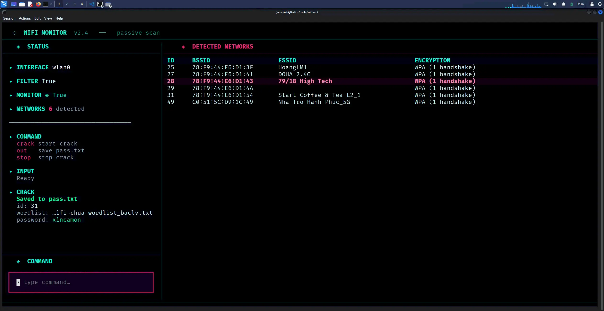
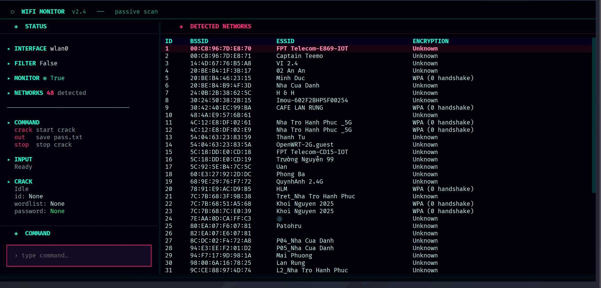
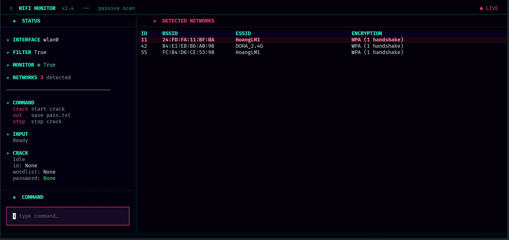

# Wifi Monitor v2

A simple TUI tool to scan Wi-Fi networks, detect WPA handshakes / PMKID, and crack them with a wordlist using aircrack-ng.

Author: dafeshh  
Version: BETA  
License: MIT  



> For educational and authorized testing only.

## Requirements

- Linux / Kali Linux
- Python 3
- USB Wi-Fi adapter with monitor mode support
- aircrack-ng
- hcxdumptool
- hcxpcapngtool
- tcpdump

## Install

```bash
sudo apt update
sudo apt install aircrack-ng hcxdumptool hcxtools tcpdump

git clone https://github.com/dafeshh/Wifi-bruteforce.git
cd Wifi-bruteforce

pip install -r requirements.txt
```

## Usage

Show only Wi-Fi networks that have handshake or PMKID:

```bash
python Wifiv2.py -i wlan0 -m --ask-sudo -f
```

## Options

```text
-i, --interface    Wi-Fi interface, default: wlan0
-m, --monitor      Start monitor mode before capture
-f, --filter       Only show crackable networks
--ask-sudo         Ask sudo password securely
--sudo-pass        Pass sudo password directly, not recommended
```

## TUI Commands

```text
crack    Start cracking
stop     Stop cracking
out      Save found password to pass.txt
Ctrl+C   Quit and cleanup
```

## Crack Usage

Inside the TUI:

```text
crack
/path/to/wordlist.txt
<target ID>
out
```

If the password is found, use `out` to save it into:

```text
pass.txt
```

## Generated Files

```text
capture.pcapng   Raw capture file
fixed.cap        Converted capture file for aircrack-ng
hash.22000       Hash file from hcxpcapngtool
pass.txt         Saved cracked passwords
```

## Demo
<table>
  <tr>
    <th>run without -f <br><code>python Wifiv2.py -i wlan0 -m --ask-sudo</code></th>
    <th>run with -f <br><code>python Wifiv2.py -i wlan0 -m --ask-sudo -f</code></th>
  </tr>
  <tr>
    <td>
      
    </td>
    <td>
      
    </td>
  </tr>
  <tr>
    <td colspan="2" align="center">
      <h3>Crack Demo</h3>
      
    </td>
  </tr>
</table>

## License

This project is licensed under the [MIT License](./LICENSE).